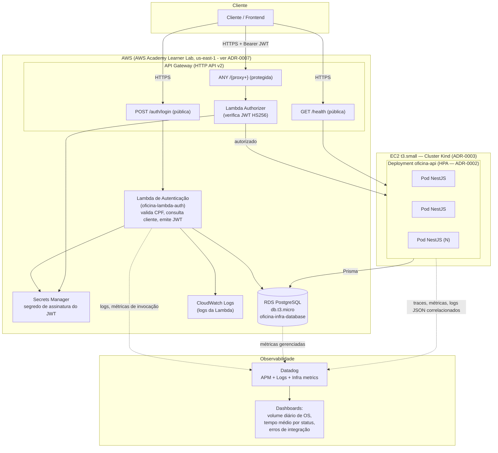

# Diagrama de Componentes — Fase 3

Visão de nuvem, APIs, banco e monitoramento da arquitetura alvo. Decisões que sustentam este diagrama estão em `docs/rfc/` e `docs/adr/`.

## Componentes e responsabilidades

| Componente | Repositório | Responsabilidade |
|---|---|---|
| API Gateway (HTTP API v2) | `oficina-infra-k8s` (Terraform) | Roteamento e controle de acesso — ver [ADR-0004](adr/0004-api-gateway-roteamento.md) |
| Lambda de autenticação | `oficina-lambda-auth` | Validar CPF, consultar cliente, emitir JWT — ver [RFC-0003](rfc/0003-estrategia-de-autenticacao.md) |
| Lambda Authorizer | `oficina-lambda-auth` | Verificar assinatura do JWT nas rotas protegidas |
| Aplicação principal (NestJS) | `oficina-api` | Regras de negócio (clientes, veículos, ordens de serviço, catálogo, estoque) |
| Cluster Kubernetes | `oficina-infra-k8s` | Executa a aplicação principal com HPA — ver [ADR-0003](adr/0003-cluster-kubernetes-local.md) |
| RDS PostgreSQL | `oficina-infra-database` | Persistência — ver [RFC-0002](rfc/0002-escolha-do-banco-de-dados-gerenciado.md) |
| Datadog | transversal (instrumentação em `oficina-api` e `oficina-lambda-auth`) | Observabilidade — latência, recursos, healthcheck, alertas, logs correlacionados, dashboards |

## Notas de leitura do diagrama

- A Lambda de autenticação acessa o mesmo RDS que a aplicação principal, reaproveitando a tabela `Customer` — não há duplicação de dados de cliente entre os dois serviços.
- O Lambda Authorizer não chama a Lambda de autenticação: ele só verifica a assinatura do token já emitido, usando o mesmo segredo do Secrets Manager. São duas funções com responsabilidades diferentes, ainda que no mesmo repositório.
- O cluster Kubernetes é Kind (não gerenciado, sem custo de control plane), mas hospedado numa EC2 `t3.small` com IP público — por isso aparece como uma caixa separada da "AWS" gerenciada no diagrama, mesmo estando fisicamente na AWS. Essa escolha existe para que o API Gateway tenha um alvo de integração de fato alcançável pela rede (ver correção registrada em [ADR-0003](adr/0003-cluster-kubernetes-local.md)) — um cluster só no notebook do desenvolvedor não seria roteável pelo Gateway.
