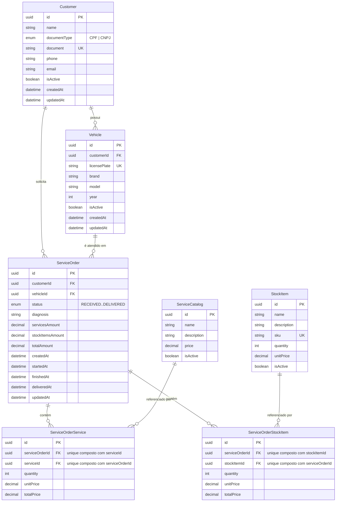

# Diagrama ER e Justificativa do Banco de Dados

Modelo derivado literalmente de `prisma/schema.prisma` (Fase 2), com os ajustes de consistência/performance desta fase destacados ao final.

## Diagrama ER

## Justificativa da escolha do banco (PostgreSQL relacional)

O domínio da oficina é intrinsecamente relacional e transacional: uma ordem de serviço agrega cliente, veículo, itens de serviço e itens de estoque, com valores (`servicesAmount`, `stockItemsAmount`, `totalAmount`) que precisam permanecer consistentes entre si e com as linhas de `ServiceOrderService`/`ServiceOrderStockItem` que os originam. Um banco de documentos exigiria recalcular/duplicar esses totais sem a garantia de atomicidade que uma transação ACID dá de graça. Isso, mais a continuidade direta com o schema Prisma já validado na Fase 2, mantém a escolha por PostgreSQL — detalhada em [RFC-0002](rfc/0002-escolha-do-banco-de-dados-gerenciado.md), que também justifica a instância gerenciada (RDS `db.t3.micro`) escolhida para esta fase.

## Explicação dos relacionamentos

- **Customer 1—N Vehicle**: um cliente pode ter vários veículos; `Vehicle.customerId` é obrigatório (não há veículo órfão).
- **Customer 1—N ServiceOrder** e **Vehicle 1—N ServiceOrder**: a ordem de serviço referencia cliente e veículo separadamente (não só via veículo) porque o domínio permite, em tese, um veículo trocar de dono ao longo do tempo sem invalidar o histórico de OS já registrado sob o dono anterior — a FK dupla preserva o snapshot correto de "quem pediu" no momento da abertura.
- **ServiceOrder N—N ServiceCatalog** via `ServiceOrderService`: modelado como tabela associativa explícita (não M:N direto do Prisma) porque a relação carrega atributos próprios — `quantity`, `unitPrice` (preço no momento da OS, não o preço atual do catálogo) e `totalPrice`. Isso é o padrão *line item*, necessário para a OS não mudar de valor retroativamente se o preço do serviço no catálogo mudar depois.
- **ServiceOrder N—N StockItem** via `ServiceOrderStockItem`: mesma lógica do item anterior, aplicada a peças/insumos de estoque.
- **`onDelete: Cascade`** em `ServiceOrderService`/`ServiceOrderStockItem`: ao excluir uma OS, seus itens de linha são excluídos junto — não faz sentido um item de linha existir sem a OS que o contém. `Customer`, `Vehicle`, `ServiceCatalog` e `StockItem` não usam cascade a partir da OS (o inverso seria destrutivo: excluir um item de catálogo não deveria apagar ordens de serviço históricas que o referenciam).

## Ajustes de consistência e performance desta fase

| Ajuste | Motivação |
|---|---|
| Índices `@@index([serviceOrderId])` e `@@index([serviceId])`/`[stockItemId])` nas tabelas associativas | Já existentes no schema da Fase 2; permanecem críticos agora porque os dashboards exigidos pelo desafio ("tempo médio de execução por status", "volume diário de OS") fazem `JOIN`/`GROUP BY` frequentes a partir de `ServiceOrder` passando por essas tabelas. |
| `document` (Customer) e `licensePlate` (Vehicle) com `@unique` | Garante no nível de banco a mesma invariante que a Lambda de autenticação depende para localizar exatamente um cliente por CPF — sem essa constraint, uma falha de aplicação poderia inserir CPFs duplicados e quebrar silenciosamente o login. |
| `startedAt`, `finishedAt`, `deliveredAt` em `ServiceOrder` | Timestamps explícitos por marco do ciclo de vida (em vez de só `updatedAt`) são o que permite calcular "tempo médio de execução por status" diretamente em SQL, sem depender de uma tabela de auditoria/histórico separada. |
| `@@unique([serviceOrderId, serviceId])` em `ServiceOrderService` e `@@unique([serviceOrderId, stockItemId])` em `ServiceOrderStockItem` (migrations de 2026-08-19) | Corrige uma corrida de concorrência real, encontrada por revisão externa: sem essa constraint, duas inclusões concorrentes do mesmo serviço/peça na mesma OS podiam criar duas linhas em vez de uma, além de sustentar o `upsert` usado na correção do lost update em `servicesAmount`/`stockItemsAmount` (ver `prisma-service-order.repository.ts`). |
| Migração de StatefulSet Postgres (K8s) para RDS gerenciado | Ganha backups automáticos e isolamento de falhas do plano de dados em relação ao cluster de aplicação — decisão registrada em [RFC-0002](rfc/0002-escolha-do-banco-de-dados-gerenciado.md). |
