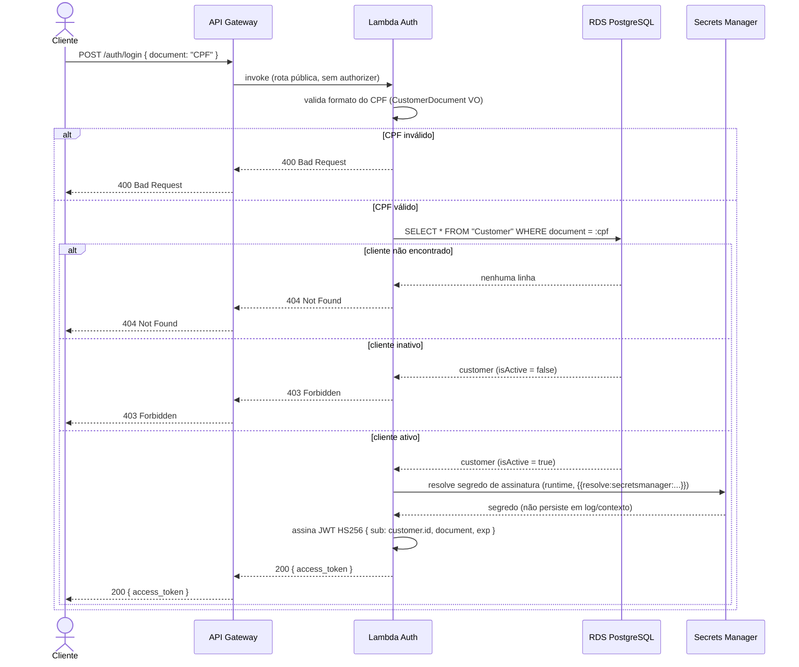
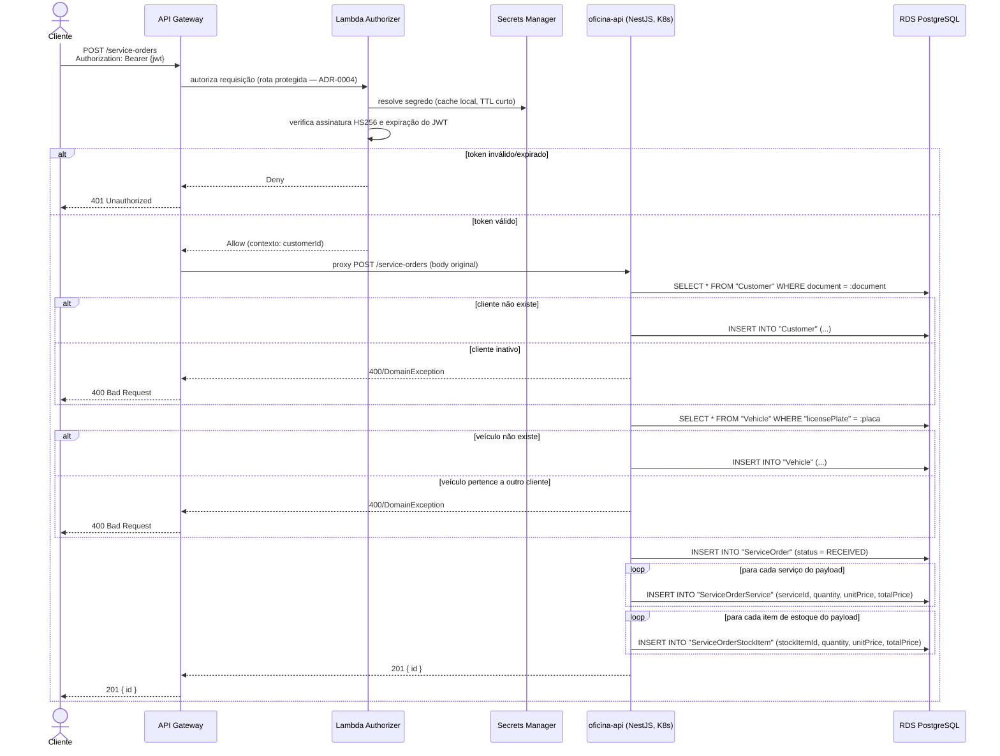

# Diagramas de Sequência — Fase 3

## 1. Autenticação por CPF

Fluxo da Lambda de autenticação (`oficina-lambda-auth`), reaproveitando a lógica de domínio de `find-customer-by-document.use-case.ts`.

## 2. Abertura de Ordem de Serviço (rota protegida)

Fluxo completo desde a requisição autenticada até a persistência, espelhando `open-service-order.use-case.ts`.

## Notas

- O Lambda Authorizer não reemite nem revalida contra o banco — ele só verifica a assinatura do token já emitido pela Lambda de auth, usando o mesmo segredo (ver [RFC-0003](rfc/0003-estrategia-de-autenticacao.md)).
- `findOrCreateCustomer`/`findOrCreateVehicle` no `OpenServiceOrderUseCase` real (`src/modules/service-orders/application/use-cases/open-service-order.use-case.ts`) fazem *find-or-create*: se o cliente/veículo já existir, reaproveita; se não, cria. O diagrama acima reflete esse comportamento em vez de assumir que o cliente já existe.
- O PDF exige logs estruturados em JSON com correlação entre requisições. Isso ainda não existe no código (`docs/observability.md` documenta só Prometheus/Grafana da Fase 2) — a implementação prevista é propagar um `correlationId` a partir do API Gateway até `App` e `Lambda`, para permitir rastrear uma requisição do cliente através de Gateway → Authorizer → aplicação nos dashboards do Datadog.
